# 🤖 Multi-Agent Document Analyzer

> **An intelligent research assistant that reads your technical documents and answers complex questions using AI.**

---

## 📖 What is this?

Imagine you have a pile of technical reports, and you need to find specific information quickly. Instead of reading them all, you ask this system.

It uses two AI agents working together:
1.  **The Manager Agent 🧠**: Understands your question and decides what information to look for.
2.  **The Specialist Agent ✍️**: Reads the found information and writes a clear, accurate answer with citations.

It's like having a smart research assistant who knows exactly where to look and how to summarize findings.

---

## 🏗️ How It Works (Architecture)

```mermaid
graph TD
    User[👤 You] -->|Ask Question| Manager[🧠 Manager Agent]
    Manager -->|Describe Search| MCP[📚 Knowledge Retriever]
    MCP -->|Search Documents| DB[(📄 Document Store)]
    DB -->|Return Snippets| MCP
    MCP -->|Provide Context| Specialist[✍️ Specialist Agent]
    Specialist -->|Synthesize Answer| User
```



1.  **You ask a question.**
2.  **Manager Agent** analyzes it. "Do I need to read the docs for this? Yes."
3.  **Knowledge Retriever** searches your document library for relevant paragraphs.
4.  **Specialist Agent** reads those paragraphs and writes a final answer, citing the sources.

---

## 🚀 How to Run It

### Prerequisites
- Python 3.9+
- API Keys for **Gemini** (Google) and **Groq**.

### 1. Setup
Run the setup script to install everything and prepare the database:
```bash
./scripts/setup.sh
```

### 2. Configure Keys
Open `config.json` and paste your API keys:
```json
{
  "api_keys": {
    "gemini_api_key": "your-gemini-key",
    "groq_api_key": "your-groq-key"
  }
}
```
> **Note**: This project uses `config.json` as a single unified interface for managing API keys and configuration values. Alternatively, you may use environment variables via a `.env` file if preferred. The system supports both approaches.

### 3. Start the Server (Knowledge Retriever)
This background service handles document searching:
```bash
uvicorn mcp_server.main:app --host 0.0.0.0 --port 8000
```

### 4. Ask Questions!
In a new terminal, run the orchestrator:
```bash
# Interactive mode
python orchestration/main.py

# Or single query
python orchestration/main.py "What were the security audit findings?"
```

---

## ✅ Features

- **Multi-Agent AI**: Uses Llama 3 (via Groq) for fast planning and Gemini Pro for high-quality writing.
- **Smart Retrieval**: Doesn't just match keywords; understands meaning (Semantic Search).
- **Citations**: Tells you exactly which document the information came from.
- **Production Ready**: Includes error handling, retries, logging, and validation.

---

## 📂 Project Structure

- `agents/`: The AI brains (Manager & Specialist).
- `mcp_server/`: The document search engine.
- `knowledge_base/`: Where your documents live.
- `orchestration/`: The script that connects everything.
- `tests/`: Automated checks to ensure reliability.

---

> **Note**: This project was developed as part of an AI Engineering internship assignment. The system was built using an iterative, AI-assisted development approach while maintaining strong engineering practices, system design principles, and production-oriented architecture.
